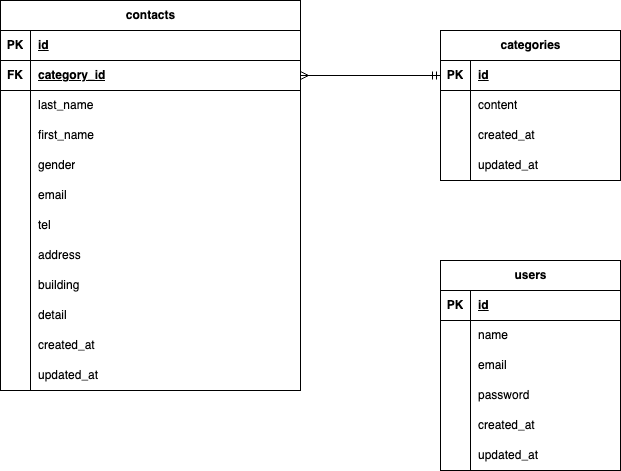

# お問い合わせフォーム

## 環境構築

```bash
# リポジトリをクローン
git clone git@github.com:kakigoori-ogura/contact-test.git
cd contact-test

# Dockerコンテナ起動
docker compose up -d

# アプリコンテナで依存関係をインストール
docker compose exec app composer install

# 環境設定ファイル作成＆アプリキー生成
cp .env.example .env
php artisan key:generate

# データベースマイグレーション＆シード
docker compose exec app php artisan migrate --seed
## 使用技術

PHP 8.2
Laravel 10.12
MySQL 8.0
Docker 24.1
Tailwind CSS
Bladeテンプレート

## ER図



## URL

- 会員登録画面: [http://localhost/register]
- ログイン画面: [http://localhost/login]
- 管理者画面: [http://localhost/admin/contacts]
- お問い合わせ入力画面: [http://localhost/contact]
- サンキューページ: [http://localhost/thanks]
```
